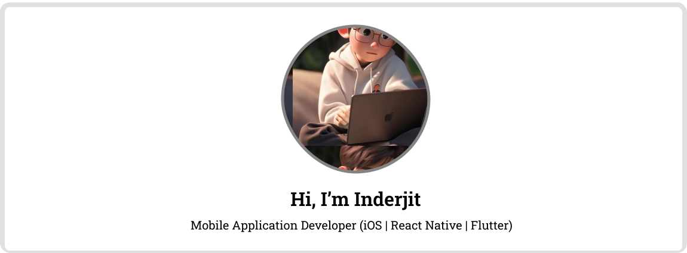

## 🚀 About Me

#### 👋 Hi, I'm self taught iOS developer with years of experience in designing, coding, and publishing mobile applications for Apple Devices (iPhone & iPad).

# Projects

## Novagems

Novagems is a scheduling & workforce management system for security guard companies where a single manager can manage the multiple guards at one time from anywhere. 

It’s a Smart Automation System for Employee Scheduling, Time & Attendance, Clock In/Clock Out, Team Chat, GPS Tracking, Tasks & Post Orders, Reports, Dashboard Analytics, and more.

Tech Used:

- UIKit

- Swift

- Core Data

- Gps tracking

- Alamofire for RESTApi

- Geofencing with Core Location

 

- 💬 Ask me about Swift, iOS Development
- 📫 How to reach me on Twitter: - @_InderJagdeo

<!--
**InderJagdeo/InderJagdeo** is a ✨ _special_ ✨ repository because its `README.md` (this file) appears on your GitHub profile.

Here are some ideas to get you started:

- 🔭 I’m currently working on ...
- 🌱 I’m currently learning ...
- 👯 I’m looking to collaborate on ...
- 🤔 I’m looking for help with ...
- 💬 Ask me about ...
- 📫 How to reach me: ...
- 😄 Pronouns: ...
- ⚡ Fun fact: ...
-->
