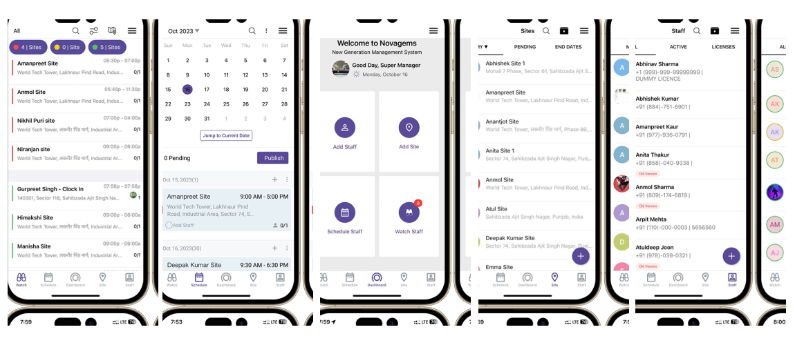
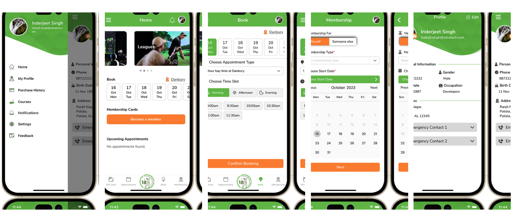
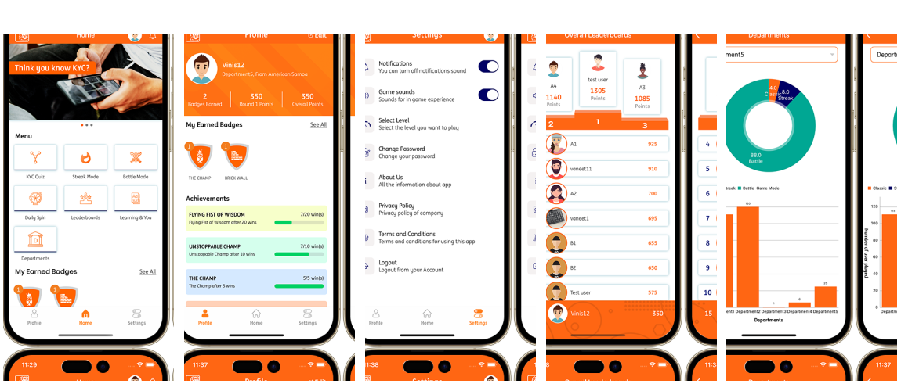

## About Me

#### 👋 Hi, I'm self taught iOS developer with years of experience in designing, coding, and publishing mobile applications for Apple Devices (iPhone & iPad).

# Projects
## Novagems

Novagems is a scheduling & workforce management system for security guard companies where a single manager can manage the multiple guards at one time from anywhere. 

It’s a Smart Automation System for Employee Scheduling, Time & Attendance, Clock In/Clock Out, Team Chat, GPS Tracking, Tasks & Post Orders, Reports, Dashboard Analytics, and more.

**Tech Used:**

- UIKit
- Swift
- WebKit
- Core Data
- Gps tracking
- Alamofire for RESTApi
- Geofencing with Core Location
- Firebase for Analytics, Crashlytics, and Remote Notifications

<!--  &nbsp; &nbsp;  -->

## Golf Lounge 18

Golf Lounge 18 app is a new resource for an enhanced guest experience. The app is designed to simplify bookings, tracks tee times, pushes notifications for promotions and ultimately rewards you for playing MORE!

It is a Leader in building Technology based Indoor Golf spaces where you can enjoy golf with friends and family all year round.

**Tech Used:**

- Java Script
- React Native
- Redux & Redux Saga
- Firebase for Analytics, Crashlytics, and Remote Notifications

## KYC Quiz

KYC Quiz is an intelligent, colorful and entertaining KYC quiz game where you can challenge your colleagues and other quizzers to games of trivia while gaining new knowledge!

- Every month there will be 4 rounds
- High-quality text questions written by the ING KYC Quiz team. Choose from tons of different categories.
- Climb the top lists – compare your knowledge against other top quizzers.
- KYC Quiz never gets old. NEW questions added daily!
- Provides learning with mobile: anytime, anywhere,

**Tech Used:**

- UIKit
- Swift
- WebKit
- Charts
- Lottie for Charts
- Alamofire for RESTApi
- Firebase for Analytics, Crashlytics, and Remote Notifications

<!--
**InderJagdeo/InderJagdeo** is a ✨ _special_ ✨ repository because its `README.md` (this file) appears on your GitHub profile.

Here are some ideas to get you started:

- 🔭 I’m currently working on ...
- 🌱 I’m currently learning ...
- 👯 I’m looking to collaborate on ...
- 🤔 I’m looking for help with ...
- 💬 Ask me about ...
- 📫 How to reach me: ...
- 😄 Pronouns: ...
- ⚡ Fun fact: ...
-->
